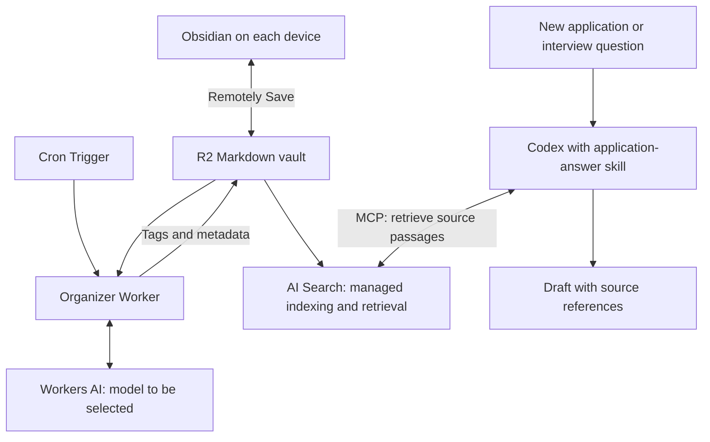

# Brag Database

A personal library of application answers and interview preparation that becomes more useful every time you write.

Write freely in Obsidian, sync Markdown to Cloudflare R2, and use Codex to retrieve relevant past experiences from the cloud and draft answers for jobs, clubs, scholarships, and programs.

## Status

This repository currently contains the project design and development instructions. Sync, the organizer Worker, AI Search, and the Codex skill still need to be configured or implemented. No cloud resources have been deployed by this repository.

The organizer model is **undecided**. The plan is to select an inexpensive model through Workers AI after testing extraction quality on representative notes. GLM and DeepSeek are candidates, not commitments.

## How it works

1. Write one Markdown file per application or interview preparation session for a position. Use headings for individual questions; normal prose, outlines, and rough notes are welcome.
2. Remotely Save synchronizes the local Obsidian vault with R2 on each device.
3. A scheduled cloud Worker enriches changed notes with tags and metadata using Workers AI.
4. Cloudflare AI Search indexes the R2 documents for semantic and keyword retrieval.
5. A Codex skill searches through AI Search's MCP interface and uses retrieved source material to draft a new answer.



**All AI retrieval uses cloud content.** Local Markdown is for editing and sync; Codex must not depend on a particular machine's vault path. R2 is the authoritative source for retrieval, reflecting the latest successfully synchronized content.

## Products and their jobs

| Product or component | Job | Value and scope |
| --- | --- | --- |
| Obsidian | Edit local Markdown notes | Keeps writing flexible and usable without an AI conversation. |
| Remotely Save | Synchronize Obsidian files with R2 | Provides cross-device editing without paying for Obsidian Sync. Runs on each device. |
| Cloudflare R2 | Store the cloud Markdown vault | Durable cloud source for search and restoration on another device. |
| Cloudflare Workers | Run the organizer | Detect changed notes, call the model, validate its output, and persist enrichment. |
| Cron Triggers | Schedule the organizer | Runs in Cloudflare even when the user's computer is off. |
| Workers AI | Supply the organizer model | Generates tags, summaries, themes, and other metadata. Model selection is pending. |
| Cloudflare AI Search | Manage indexing and retrieval | Handles chunking, embeddings, search indexes, and updates from its connected R2 source; configure semantic and keyword search. |
| Vectorize, managed through AI Search | Support semantic similarity retrieval | Finds similar experiences despite different wording. No separate application-managed vector index or embedding pipeline is planned. |
| AI Search MCP interface | Expose cloud search to Codex | Provides a reusable access point across machines; configure authenticated access. |
| Codex | Draft application and interview answers | Uses retrieved evidence plus the new prompt, audience, and length constraints. |
| Custom Codex skill | Define the answer-writing workflow | Specifies when and how to search, select examples, preserve voice, and report missing information. Still to be authored. |
| D1 | Optional future structured database | Not required for version 1. Reconsider for relational queries, dashboards, or operational state if a concrete need emerges. |

AI Search replaces the custom D1 full-text catalogue and manually maintained Vectorize pipeline discussed earlier. The organizer still needs to track its own processing state; AI Search only manages its indexing state.

## Notes and organization

Suggested structure inside the synced vault:

```text
Applications/
  2026-09_organization_program.md
Interview Prep/
  2026-09_organization_position.md
Stories/                                  # optional reusable experiences
```

Keep the original question, your response, and supporting notes together. Label final/submitted answers when known; the organizer should preserve ambiguity when status is unknown. This is a suggested format, not a mandatory form:

```markdown
# Organization — Position

## Tell us about a time you resolved a disagreement.

### Answer — draft
My response or preparation outline...

### Notes
What I learned, details to confirm, and possible follow-up questions...
```

The organizer should infer useful themes and add metadata without inventing experiences or rewriting the user's response. Store its schema version, content hash, and processing timestamp in a clearly owned metadata namespace or separate R2 state objects. Exclude generated metadata from the source hash so enrichment does not trigger endless reprocessing.

Start by indexing the original Markdown. If real retrieval tests show that multiple answers in a file are being mixed or split poorly, generate one derived search document per answer in an isolated R2 prefix or bucket. Preserve exact source text and source references, exclude originals from that search instance to avoid duplicates, and keep derived files outside the Obsidian sync scope. This is an optional refinement, not a version 1 requirement.

## Sync, freshness, and writeback

There are three independent clocks: device sync, organizer scheduling, and AI Search ingestion. Newly written notes become remotely searchable only after upload and indexing; enrichment can arrive later.

- Configure Remotely Save's sync-on-save and periodic sync per device. The plugin requires Obsidian to be running and able to execute; closed apps, sleeping machines, and mobile background restrictions delay uploads.
- The organizer runs in the cloud. Its exact schedule and quiet period before processing active notes remain configurable.
- Use conditional R2 writes and preserve object metadata. Retry changed files later instead of overwriting a newer cloud version.
- An R2 ETag check cannot detect unsynced local edits. Validate Remotely Save's handling of external writes, timestamps, conflicts, and deletions in a disposable vault before enabling unattended Markdown writeback. A quiet period reduces collisions but does not eliminate them.
- If direct writeback is unreliable, keep enrichment in separate R2 objects and search documents until a safe writeback path exists.
- Two-way sync propagates deletions. Keep recoverable history or backups for the vault; sync alone is not versioned backup.

AI Search's filterable attributes may need R2 object metadata; YAML tags inside Markdown must not be assumed to become filter fields automatically. Map metadata explicitly when implementing filters.

## Answer-writing behavior

The planned skill will retrieve relevant cloud passages, inspect their source context, and draft using supported facts. It should adapt to written application answers or spoken interview outlines, respect word limits, and distinguish individual contributions from team outcomes.

Prefer approved or submitted answers when available, while checking dates and context. Keep original facts separate from AI summaries. Never invent numbers, responsibilities, motivations, or outcomes. Return source references separately from the paste-ready answer and ask targeted questions when important facts are missing. If cloud search is unavailable, report that rather than silently using local notes.

Final answers should be saved into the user's application note through an explicit save workflow so future retrieval benefits from the work. Automatic submission to application portals is outside the initial scope.

## Implementation roadmap

- [ ] Configure a private R2 bucket and Remotely Save on a disposable test vault.
- [ ] Connect AI Search to R2 and verify semantic and keyword retrieval through authenticated MCP access.
- [ ] Compare inexpensive Workers AI models for faithful extraction, latency, and cost; select a model separately from AI Search's embedding model.
- [ ] Implement incremental organization, validated metadata, bounded retries, and safe writeback.
- [ ] Write and install the Codex application-answer skill.
- [ ] Test cross-device sync, cloud-only retrieval, updates, deletions, and answer citations with fictional examples.
- [ ] Bring in existing interview and application notes after the workflow is verified.

See [AGENTS.md](AGENTS.md) for implementation constraints. There is no build or test command yet because the repository contains documentation only. Keep real notes and credentials outside this repository.

## Documentation

- [Remotely Save](https://github.com/remotely-save/remotely-save)
- [Cloudflare AI Search: how it works](https://developers.cloudflare.com/ai-search/concepts/how-ai-search-works/)
- [AI Search R2 source and object metadata](https://developers.cloudflare.com/ai-search/configuration/data-source/r2/)
- [AI Search overview and MCP integration](https://developers.cloudflare.com/ai-search/)
- [Cloudflare Cron Triggers](https://developers.cloudflare.com/workers/configuration/cron-triggers/)
- [R2 conditional operations](https://developers.cloudflare.com/r2/api/workers/workers-api-reference/)
- [Workers AI model catalogue](https://developers.cloudflare.com/workers-ai/models/)

Verify current APIs, supported models, indexing behavior, and pricing during implementation rather than treating this design as a deployed configuration.
